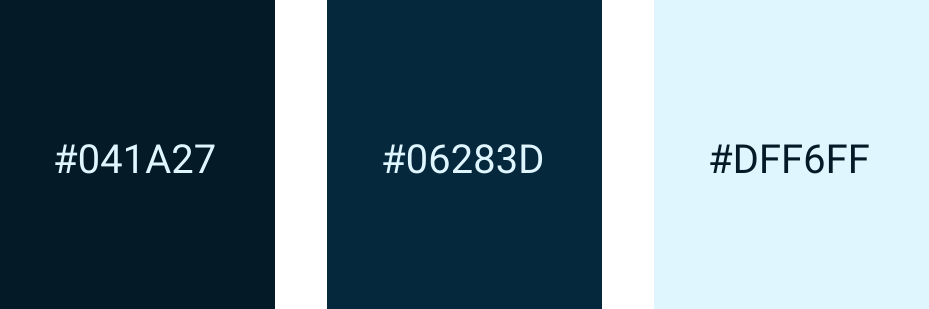
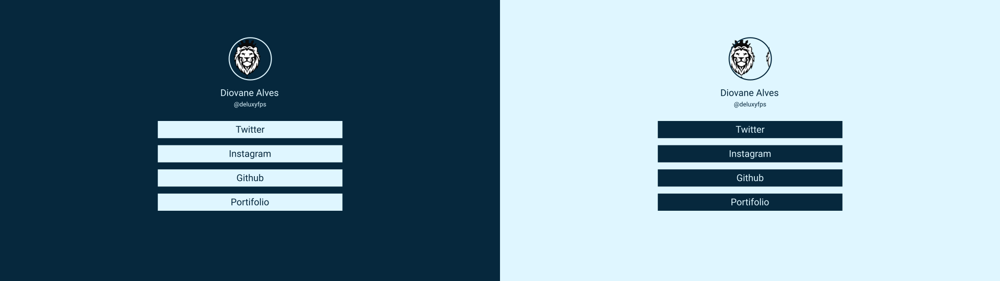

# Linktree
Project based on the Linktree platform 

# About
This project aims to spread many links, without the need to list them all in a small space.

[Link Project](https://diovanealves.github.io/Linktree/)

# New Implementations
- [X] Dark Mode
- [X] Footer

# Imagen Project

  

      

# What was used in the Project
[Visual Studio Code](https://code.visualstudio.com)

[Figma](https://www.figma.com/)

[Flexbox](https://css-tricks.com/snippets/css/a-guide-to-flexbox)

[Font Roboto](https://fonts.google.com/specimen/Roboto)